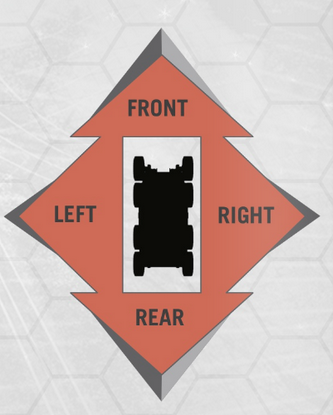

# Ship Combat

Ship combat follows this process. First initiative is taken to establish the turn order of the combat. A ship turn consists of the following items that are taken following order. First a ship takes its movement actions following the movement rules above. If a ship enters the adjacent range of another ship then “bullet time”, or normal 5e combat begins. Then each role on the ship may take a role action.

## Initiative

When combat begins, the helmsman of each ship makes an initiative check using the ship's dexterity. The initiative rolls follow this format: 1d20 roll + Ship Dexterity + Ship Speed + proficiency in water vehicles.

## Movement

The helmsman of the ship is in charge of all movement actions. Without the helmsman the ship cannot turn and no new movement actions can be issued.
Ship Speed Categories:

* Fast: 4+
* Average: 2-3
* Slow: 1

## Rules

You get a number of movement actions equal to your speed and can use them in the following ways.

* Move: This is what allows you to move your ship in between range bands. In order to move into an adjacent range band you must spend a number of movement actions equal to the score of the range band.
* Turn: turning costs a number of movement actions equal to 1 + the number of movement actions taken this turn + last turn. You can turn up to 90 degrees in increments of 45 degrees. If the ship is larger the number of actions to turn the ship may increase.
* Drop anchor: at the cost of 1 movement action you may choose to immediately stop your ship. If you do the ship take damage equal to the number of movement actions you have taken this turn and last turn. You may choose to immediately turn 90 degrees.

## Increasing Ship Speed

A ship's speed can be increased through magical effects like control winds or water or by boosting.

* Boosting: boosting requires all available crew, other than the captain, lookout, and helmsman, to be stationed as a ship hand. Choosing to boost increases the ship’s speed by half the ship’s current speed rounded down. For each consecutive turn past the first that the ship boosts, the crew of the takes 1 point of exhaustion.
* Magical effects: These effects can increase the speed of a ship by half of the spell level used to create the effect rounded up
* Class features: These effects can increase the speed of a ship by half of the class level of the class of the feature creating this effect, rounded down. For example if you are an 8 level storm sorcerer with 2 additional levels in rogue, you can choose to increase the speed of the ship by 4 with your storm guide ability.
* Damage due to movement: If a ship were to move over twice its normal speed, it will take 1d6+the additional speed halved (rounded down) of ship damage at the end of its turn

## Making Attacks

Attacks may be made with cannons or a caster may cast spells if they are within range. Attacks with cannons are made in firing arcs. These are 90 degree arcs that are determined by what side of the ship the weapons are on. There are usually only 4 arcs that can exist: front, back, left side, and right side. You cannot attack something with a cannon outside its firing arc and range. The most skilled person, or the person with the highest bonuses, will make the roles using their stats and bonuses.

Cannons: requires ranged attack roll. Cannons have a -5 to hit anything. You may make a number of attacks equal to the ship’s dexterity modifier (min 1). Each attack can use a number of cannons that you have not used yet this round. Each attack does damage equal to the combined damage of each cannon used in the attack

## Bullet Time

When a ship enters the adjacent range of another ship both ships enter bullet time, or 6 second combat. The ship that used the movement action to enter the adjacent zone may immediately attempt to ram the opponent ship. Moving into the adjacent zone triggers any boarding actions marines have taken after ramming actions have been taken. Initiative rolls are then made for each creature entering the combat. Creatures not engaging in the combat will act on a lair action(initiative of 20) and will act simultaneously.

* Ramming: When ramming, the helmsman may choose to make an attack roll to hit the rudder. If the helmsman does not hit, or does not choose to aim for the rudder, they will automatically hit the hull.
* Boarding: These are any prepared actions from marines to get to the other ship or prevent others from getting onto the ship. This primarily includes jumping, grappling hooks, boards for crossing, and magical effects to close distances.
* Grappling Hooks: In order to connect a grappling hook from one ship to another ship a DC 17 Athletics check. To release a grappling hook off requires a DC 15 athletics check.
* Pulling to ships together with grappling hooks: While a grappling hook is attached to a ship, anyone may take the action to pull the ships 10 ft closer together. This requires a DC 30 athletics check. The DC of this check Is decreased by 5 for every grappling hook attached.
* Cannons in Bullet Time: Requires ranged attack roll. Cannons have a -5 to hit anything. Cannons take 2-3 turns to fire in bullet time. One turn to reload the cannon, one turn to aim, and one turn to fire. Then attack rolls are made by the cannoneer to hit a target. If the target is the hull of the ship the attack automatically hits. If it is a creature the cannoneer must roll to hit against that person’s AC. If a creature is hit with a cannon ball in bullet time every creature within 10 ft of the creature hit must make a DC 12 dexterity saving throw or take 6d6 fire damage, half on a success.

## Ending Combat

Combat is ended if a ship sinks, all enemy combatants are incapacitated, or if a ship remains in the very far range for 4 or more turns.
